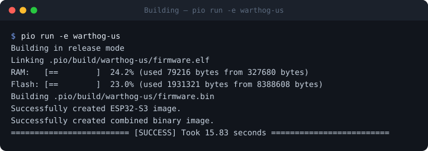
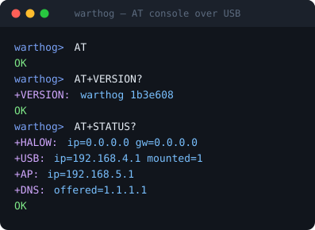
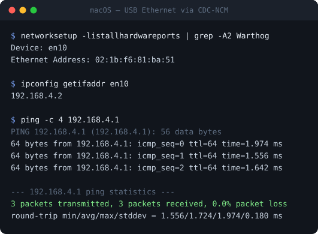
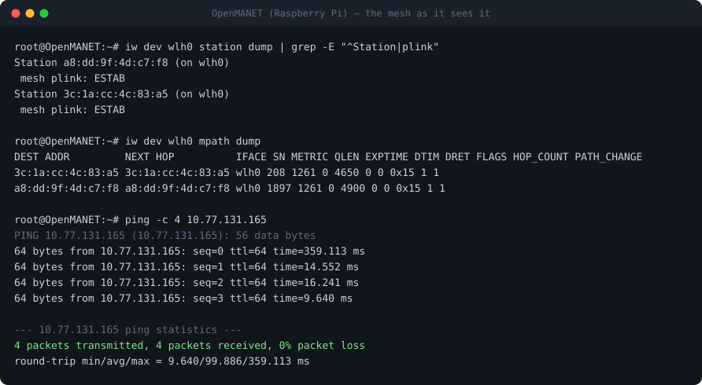

# Warthog

```
           .                   .
           .        :      ----::
           .        :...........:-:.-..:-
           .            :.--.:-::
           .            :..-....:
           .              ...:  :::
           .            .:...:-..:::.-------:--:.--::-.
           .           -...-.:.:...             ::..:......::..
    .:..:::-         :..-.-...-...:.         :. .-:...:::::::::-::...::.
    .:.::::--..:................:.:          :..............:.:-------:: .
     .-::::-..:-........::::..:----.:     ::...----:....-..::--:.......-::
        -----:---------:..:..:.......--:------.......::..:.---.........:.:
        :.....:---:----..:..:..::..................-...-:-...:---:-:.....--
       ...---.::---::.---:..-::...---------------....--.:..-.::-----.-...--.
        .  -::.......::--:.-..:-:...:..........:...-:.-..--:-.......:.--:.-
          ::-.........-::...-:......-..........-:...::...::-.........-:.
          :.-.........:.:      :-------------------.     :.:............
          :..:........:.:                                ..:.........-.:
           ..:-.....-:::                                  :.:-.....-:.:
             :::.:.:.-                                      ::..:.:.-
```

> **Warthog** — open-source firmware turning an ESP32-S3 + Wi-Fi HaLow module into a long-range USB Ethernet and 2.4 GHz Wi-Fi AP gateway you can hack.

Plug it into a laptop and the host gets a USB Ethernet adapter. Join the side-car 2.4 GHz Wi-Fi AP from a phone or IoT client and you share the same uplink. Both surfaces are NAT'd out a sub-GHz 802.11ah HaLow link with kilometer-class range. A CDC-ACM console exposes an AT-command surface for runtime reconfig without reflashing.

## Features

- USB **CDC-ECM** network adapter for the host (macOS / Linux native; Windows-RNDIS is a roadmap item)
- Secondary **2.4 GHz Wi-Fi AP** for clients that can't (or shouldn't) be wired
- **HaLow STA uplink** via Morse Micro MM6108 / Quectel FGH100M-H — kilometer range at low power
- **lwIP NAPT** bridges both downstream surfaces out HaLow
- USB **CDC-ACM** console with mirrored ESP-IDF logs and an **AT command** surface for runtime SSID/PSK changes
- NVS-persisted credentials — no reflashing to retarget the uplink
- Per-region release builds (US / EU / JP / KR / AU), BCF + country code baked in at compile time
- Built on **ESP-IDF 5.5 + TinyUSB + `morsemicro/halow`**

## Documentation

Full guides live in the [wiki](../../wiki) — quick start, flashing, each
operating mode, the AT reference and troubleshooting. Deep technical notes are
versioned alongside the code in [`docs/`](docs/).

## Operating modes

Warthog is not one device role. A node runs an **uplink** and presents
**downstream surfaces** to whatever is plugged into or associated with it.

```
        ┌──────── downstream ────────┐        ┌──── uplink ────┐

  laptop ──USB──▶ CDC-ECM ┐
                          ├─▶ NAPT ─▶ HaLow ─▶  AP  (station mode)
  phone  ──WiFi─▶ 2.4 AP  ┘                or  mesh (802.11s peers)
```

| Mode | What it does | Chosen |
|---|---|---|
| **Host** | Gives the machine it is plugged into a USB Ethernet adapter (`192.168.4.1/24`) | always on |
| **Client** | 2.4 GHz AP so phones and IoT clients share the uplink (`192.168.5.1/24`) | always on |
| **Station uplink** | Joins an existing HaLow access point | default builds |
| **Mesh uplink** | 802.11s peer-to-peer, no infrastructure | `warthog-mesh-smoke` build |

Both downstream surfaces are live at once. The two uplink modes are mutually
exclusive and selected at build time.

## USB setup, end to end

Three commands from a fresh checkout to a working link. The screenshots below
are real sessions against an attached board, regenerated by
`scripts/regen-screenshots.sh`.

### 1. Build

```bash
pio run -e warthog-us
```



### 2. Flash

**No toolchain?** Use the [web flasher](https://thebentern.github.io/warthog/) —
Chrome, Edge or Opera, no install. It also has a Configure tab that drives the
same AT commands from the browser.

The HaLow add-on drives USB-OTG, so `esptool` cannot pull the board into
download mode over DTR/RTS. Do it by hand — **hold BOOT, tap RESET, release
BOOT** — then:

```bash
pio run -e warthog-us -t upload
```

Tap **RESET** when it finishes.

### 3. Talk to it

A CDC-ACM console appears as `/dev/cu.usbmodem*` (macOS) or `/dev/ttyACM*`
(Linux). Any terminal at 115200 8-N-1:



`AT+STATUS?` reports every surface at once: the HaLow uplink, the USB network,
the Wi-Fi AP, and the DNS handed to downstream clients.

### 4. Use the network

The same cable also presents a **USB Ethernet adapter**. The host picks up a
DHCP lease from the board and can route out over HaLow:



That is a stock macOS driver binding a stock USB class — nothing to install.

## Connecting phones and tablets

The USB surface presents **CDC-NCM**, which every current host binds with an
in-box driver — macOS, Linux, Windows 10+ and iOS/iPadOS. The class matters far
more than the cable:

| Client | Over USB | Over the Wi-Fi AP |
|---|---|---|
| macOS laptop | ✅ verified — DHCP lease, 300/300 at 1400 B, ~1.5 ms | ✅ |
| Linux laptop | ✅ expected — `cdc_ncm` in-tree since 2.6.38 (not re-verified) | ✅ |
| Windows laptop | ✅ expected — `usbncm.sys` in box on Windows 10+ (untested) | ✅ |
| iPhone / iPad | ✅ expected — Apple's in-box NCM driver, no dext or MFi (untested here) | ✅ |
| Android phone/tablet | ⚠️ untested — needs USB host mode; also has to power the board | ✅ recommended |

### Why an iPad works over USB now

warthog used to present CDC-ECM, which macOS and Linux bind and iOS does not —
so a cable to an iPad did nothing. It now presents **CDC-NCM**, the class Apple
binds with its own driver: no dext, no MFi, and it works in airplane mode
because the link is not a radio.

Two things that made this work, both easy to get wrong:

- **TinyUSB must resolve to >= 0.21.0**, pinned in `main/idf_component.yml`.
  `esp_tinyusb` alone only asks for `>= 0.17.0~2`, so the resolve was landing
  on 0.19.0 by luck; below 0.21.0 the NCM control requests are unreliable.
- **The configuration descriptor is built by `esp_tinyusb`, not by hand.** A
  hand-rolled composite serves ECM fine and is rejected outright for NCM, in a
  way that looks like dead hardware: the device still answers its device and
  string descriptors, so it appears in a hub listing with the right name while
  the host never creates a device for it.

Two caveats that remain:

1. **The phone has to be the USB host** — OTG mode, a suitable adapter, and the
   phone supplies the power. The HaLow PA needs a bulk capacitor even from a
   laptop port ([`docs/power-notes.md`](docs/power-notes.md)); a phone port is a
   worse supply.
2. **Two warthogs on one host collide.** Both vend `192.168.4.1/24`, so a host
   with two attached configures only one and the other falls back to a
   link-local address. Fine on a bench, worth knowing.

If you meet a host that binds ECM and not NCM, `warthog-us-ecm` builds the old
class as a fallback.

## How Warthog compares

There are off-the-shelf HaLow USB adapters that just work — Heltec HT-HD01 V2, Alfa Network AHUS-1, Vantron's MM8108 dongles. If you need a HaLow uplink for a laptop today and don't want to think about firmware, **buy one of those.** They're vendor-supported and require zero assembly.

Warthog is for a different audience: people who want to *own* the firmware on a HaLow gateway and ship custom behavior on top.

| | Commercial dongles (Heltec / Alfa / Vantron) | Warthog |
|---|---|---|
| Firmware | Closed, vendor binary | **Open source** (GPL-3.0); ESP-IDF + TinyUSB + `morsemicro/halow` |
| Hardware | Pre-built USB stick | XIAO ESP32-S3 + Seeed HaLow add-on (~$30 BOM) — needs a [bulk-cap mod](docs/power-notes.md) on this specific board |
| Host surface | USB Ethernet only | USB CDC-ECM **+** CDC-ACM console **+** 2.4 GHz Wi-Fi AP |
| Runtime config | Vendor app or fixed defaults | **AT commands** over the CDC port (`AT+HALOW=ssid,psk`), NVS-persisted |
| Secondary clients | Need their own USB host | Join the Wi-Fi AP — no USB required |
| Region story | Vendor-locked, opaque | Per-region build artifacts; BCF + country code explicit at compile time |
| Customization | Whatever the vendor shipped | Drop in additional USB classes, telemetry over CDC, MQTT bridge, web UI — it's just an ESP-IDF project |
| Docs | Datasheet | The gotchas captured: power delivery, NAPT inversion, USB-OTG handoff (see `docs/`) |

**Short version:** want a HaLow USB adapter today? Buy a dongle. Want a hackable HaLow + USB + Wi-Fi AP gateway with an AT control plane on hardware you understand? Build Warthog.

## Hardware

Tested target:

- [Seeed Studio XIAO ESP32-S3](https://www.seeedstudio.com/XIAO-ESP32S3-p-5627.html)
- [Seeed Studio Wi-Fi HaLow module for XIAO](https://www.seeedstudio.com/Wi-Fi-HaLow-Module-for-Seeed-Studio-XIAO-p-6262.html) (Quectel FGH100M-H, MM6108)
- External 900 MHz antenna via I-PEX → SMA pigtail

> ⚙️  **Required mod for this combo:** the Seeed add-on routes the FGH100M-H's PA supply (`VDD_FEM`) straight to USB VBUS with only 20 µF of bulk capacitance. The radio's turn-on inrush collapses the rail under PA load and the ESP32-S3 `POWERON`-resets. Add a **470–1000 µF / ≥ 10 V** low-ESR cap across the XIAO's 5V ↔ GND pads before flying. Full diagnosis + waveform reasoning in [`docs/power-notes.md`](docs/power-notes.md).

## Releases

Tagged releases ship per-region binary bundles on the [GitHub releases page](../../releases). Each bundle contains:

| File | Purpose |
|------|---------|
| `warthog-vX.Y.Z-REGION.factory.bin` | Single-shot flash: bootloader + partitions + app, write to offset `0x0` |
| `warthog-vX.Y.Z-REGION.bin` | App-only image (e.g. for OTA), write to `0x10000` |
| `warthog-vX.Y.Z-REGION.elf` | Debug symbols (for `addr2line` against a panic backtrace) |
| `warthog-vX.Y.Z-REGION-{bootloader,partitions}.bin` | Components if you want to flash piecewise |
| `flash.sh` | POSIX shell flasher (auto-detects port, wraps `esptool`) |
| `SHA256SUMS.txt` | Covers every asset in the release |

Hold the XIAO's **BOOT** button, tap **RESET**, release BOOT to enter download mode, then:

```bash
./flash.sh warthog-v0.1.0-us.factory.bin
```

Tap RESET on the XIAO when it finishes.

## Build & flash

Build for your region:

```bash
pio run -e warthog-us       # United States (902–928 MHz)
pio run -e warthog-eu       # Europe (863–868 MHz)
pio run -e warthog-jp       # Japan (916.5–927.5 MHz)
pio run -e warthog-kr       # Korea (917.5–923.5 MHz)
pio run -e warthog-au       # Australia
pio run -e warthog-mesh-smoke   # 802.11s mesh (see Mesh mode below)
```

Flash (XIAO + HaLow uses USB-OTG, so the auto-reset path is gone — hold **BOOT**, tap **RESET**, then run):

```bash
pio run -e warthog-us -t upload
pio device monitor -e warthog-us
```

Configure HaLow credentials at build time:

```bash
pio run -e warthog-us \
  -DHALOW_SSID=\"MyHaLowAP\" -DHALOW_PASSPHRASE=\"secret\"
```

Other build-time defaults you can override the same way (all live in `[warthog_base]` in `platformio.ini`):

| Macro | Default | What it controls |
|---|---|---|
| `WARTHOG_AP_SSID` | `warthog` | 2.4 GHz AP SSID |
| `WARTHOG_AP_PSK` | `warthog-default` | 2.4 GHz AP WPA2 passphrase |
| `WARTHOG_USB_GW_IP` / `_NETMASK` | `192.168.4.1/24` | USB ECM subnet (host gets `.2+`) |
| `WARTHOG_AP_GW_IP` / `_NETMASK` | `192.168.5.1/24` | Wi-Fi AP subnet |
| `WARTHOG_DOWNSTREAM_DNS` | `1.1.1.1` | DNS handed to USB + AP clients via DHCP option 6. See [Troubleshooting](#troubleshooting) — getting this wrong is what makes `ping 8.8.8.8` work while `curl example.com` hangs. Override with `AT+DNS=` at runtime instead of reflashing. |

These are compile-time defaults only; everything in NVS (HaLow creds, AP creds, DNS — see AT commands below) wins over them at boot.

## Runtime configuration (AT commands)

The CDC-ACM port (`/dev/cu.usbmodemXXXX` on macOS) accepts AT commands so you don't have to reflash to change credentials. Connect with any serial terminal at 115200 8-N-1 (baud is ignored by CDC):

```
AT                          → OK
AT+VERSION?                 → +VERSION: warthog 0.1.0-dev / OK
AT+STATUS?                  → +HALOW: ip=... / +USB: ip=... mounted=1
                              +AP: ip=... / +DNS: offered=1.1.1.1 / OK
AT+HALOW=MyAP,secret        → store HaLow creds in NVS; AT+RESET to apply
AT+HALOW?                   → +HALOW: ssid="MyAP" (psk hidden) / OK
AT+WIFIAP=warthog,xyz,11    → change AP SSID/PSK/channel
AT+WIFIAP?                  → +WIFIAP: ssid="warthog" chan=6 (psk hidden) / OK
AT+DNS=8.8.8.8              → set the DNS handed to USB + AP clients via DHCP
AT+DNS?                     → +DNS: 1.1.1.1 / OK
AT+RESET                    → reboot
AT+ERASE                    → wipe NVS warthog namespace
```

`AT+DNS=` validates the input via `inet_pton`; malformed addresses (`AT+DNS=garbage`, `AT+DNS=1.2.3`, `AT+DNS=0.0.0.0`) come back as `+ERR: not a valid IPv4 address` / `ERROR` without touching NVS. To revert to the build-time default (`WARTHOG_DOWNSTREAM_DNS`), run `AT+ERASE` — that wipes the whole namespace including HaLow / AP creds, so you'll re-enter those too.

Credentials and the custom DNS live in NVS namespace `warthog`. On boot, `halow.c`, `wifi_ap.c`, and `usb_net.c` read NVS first and fall back to the `-DHALOW_SSID=...` / `-DWARTHOG_AP_SSID=...` / `-DWARTHOG_DOWNSTREAM_DNS=...` build flags only if the NVS entry is absent.

## Mesh mode (802.11s)

Instead of associating to an access point, a node can join an 802.11s mesh over
HaLow. Every node is a peer — nothing to elect, nothing to associate to, and a
node that loses power takes only its own links with it.

```bash
pio run -e warthog-mesh-smoke -t upload
```

Nodes address themselves statically from their own MAC — `10.77.<mac[4]>.<mac[5]>/16`
— so `3c:1a:cc:4c:83:a5` is `10.77.131.165`. There is no DHCP on the mesh.

```
AT+MPMPEERS?                     peers and handshake state
AT+MESHSEC=0                     open data plane (needed for unencrypted peers)
AT+MPING=10.77.199.248,4         confirm data
```

### Interoperating with OpenMANET / OpenWrt

Warthog meshes with Linux `mac80211` peers. Verified against OpenMANET 1.8.0 on
a Raspberry Pi 4 with a Seeed HaLow HAT, meshing with two Warthog nodes at once —
0–3% loss, 8–19 ms round trip, with the peer in its stock configuration.

What the OpenMANET side sees once a warthog has joined — established peer
links, resolved paths at hop count 1, and answered pings:



**The point of doing this** is to hang phones and EUDs off your mesh: a warthog
joins as a peer and presents a Wi-Fi AP and a USB Ethernet adapter on the other
side. That story, end to end, is in the wiki:
[OpenMANET Gateway](../../wiki/OpenMANET-Gateway).

Two OpenWrt defaults will stop it dead, each with no error message: the mesh
interface is bridged into `br-lan`, and unbridging it drops it out of the `lan`
firewall zone. Both are covered, with the diagnostic signature of each, in
[`docs/mesh-openmanet.md`](docs/mesh-openmanet.md).

## Troubleshooting

### "`ping 8.8.8.8` works but `curl example.com` hangs"

Classic DHCP-DNS gap. The symptom is exact: ICMP to a numeric IP returns within ~90 ms (HaLow RTT), but any name resolution stalls.

**Cause.** The Warthog DHCP server has to hand the host a DNS resolver via DHCP option 6, *and* that resolver has to be reachable through the NAT chain. Two ways that breaks:

1. **No DNS option** — the host gets only IP + gateway, falls back to its primary-interface resolver (usually a `192.168.x.1` or `10.x.x.1` from Wi-Fi), and tries to query that LAN IP through the Warthog USB tunnel. The LAN IP isn't reachable through HaLow's NAT, so DNS just times out.
2. **DNS option present but unroutable** — the upstream HaLow AP's DHCP lease hands the ESP32 a *LAN-side* resolver (e.g. on the HaLowLink 2 it's `192.168.12.1`). If we re-advertised that to downstream USB clients, the Mac would NAPT a DNS query through HaLow targeting `192.168.12.1` — which the HaLowLink only answers for clients on its own subnet, not for NAT'd traffic arriving from upstream. Same hang.

**Fix.** Warthog hands out a *publicly reachable* resolver instead. Default is **`1.1.1.1`** (Cloudflare) — works through any NAT chain, no LAN dependency. Override at runtime if you'd rather use `8.8.8.8` or a private resolver you actually run:

```
AT+DNS=8.8.8.8
AT+RESET
```

…or at build time, e.g. for a fleet that ships pointed at a Pi-hole on the upstream LAN:

```bash
pio run -e warthog-us -DWARTHOG_DOWNSTREAM_DNS=\"10.0.0.53\"
```

**Verify on macOS** (after reflash + fresh DHCP lease):

```bash
ipconfig getpacket en10 | grep domain_name_server
# Expected: domain_name_server (ip_mult): {1.1.1.1}
```

If the new firmware shows the right DNS but the Mac still uses the old one, kick the lease: `sudo ifconfig en10 down && sudo ifconfig en10 up`, or unplug+replug the USB-C cable. macOS otherwise caches the original lease for hours.

**Verified path.** This was the actual failure on a HaLowLink 2 + Warthog bench: `ping 8.8.8.8` came back at 85–92 ms, DNS hung indefinitely, `ipconfig getpacket` showed no `domain_name_server` entry. Fixing it required *two* ESP-IDF calls per netif (USB + Wi-Fi AP), not one:

```c
dhcps_offer_t offer_dns = OFFER_DNS;
esp_netif_dhcps_option(netif, ESP_NETIF_OP_SET,
                       ESP_NETIF_DOMAIN_NAME_SERVER,
                       &offer_dns, sizeof(offer_dns));   /* enable option 6 emission */
esp_netif_set_dns_info(netif, ESP_NETIF_DNS_MAIN, &dns); /* set the IP to advertise */
```

The trap: `esp_netif_set_dns_info` alone *looks* sufficient — it stores the IP in the dhcps struct — but lwip's dhcpserver only includes DHCP option 6 in offers when the `dhcps_dns` enable bit is set, which defaults to `0x00`. Skipping the `dhcps_option(OFFER_DNS)` call is a silent no-op for clients. See `main/usb_net.c` and `main/wifi_ap.c` for the working pattern.

### Debug logging

Verbose runtime diagnostics are gated behind a single build flag so production logs stay quiet. Enable for a debug build:

```bash
PLATFORMIO_BUILD_FLAGS="-DWARTHOG_DEBUG=1" pio run -e warthog-us -t upload
```

That switches on:

- `warthog.nat: tick: halow_ip=… usb.napt=1 ap.napt=1 default=…` every 30 s — confirms the NAPT supervisor is enforcing state.
- `warthog.nat: HaLow STA IP changed: X -> Y (NAPT table now stale; downstream clients will see drops)` — fires on STA re-association with a new IP, the most common cause of "iPad worked for 2 min then said no internet."
- Future diagnostic blocks should be gated with the same `#if WARTHOG_DEBUG` so we have one knob, not a dozen.

### When in doubt

The CDC console (`/dev/cu.usbmodemXXXX`) carries all ESP-IDF logs after USB-OTG takes over, and `AT+STATUS?` gives a one-shot view of every netif's IP plus the currently-offered DNS. See `docs/` for diagnoses of the gotchas we've already hit (`power-notes.md`, `napt-notes.md`).

## Status

| Phase | Description | Status |
|-------|-------------|--------|
| 0 | Repo skeleton + PlatformIO/IDF build | ✅ |
| 1 | HaLow STA bring-up | ✅ SAE association + DHCP lease verified against a HaLowLink 2 |
| 2 | USB net device (CDC-ECM, macOS/Linux) | ✅ DHCP + ping verified on macOS |
| 3 | 2.4 GHz Wi-Fi AP | ✅ SSID `warthog` visible |
| 4 | lwIP NAPT bridge | ✅ end-to-end internet verified (Mac → USB → HaLow → upstream → 8.8.8.8) |
| 5 | Polish (LEDs, AT, NVS) | ✅ partial — LED state machine, AT commands, NVS persistence shipped. Windows RNDIS, NCM (iOS) and a web UI deferred. |
| 6 | 802.11s mesh over HaLow | ✅ peering, data plane and HWMP path selection; 3-node mesh verified |
| 7 | OpenMANET / OpenWrt interop | ✅ 0–3% loss, 8–19 ms against OpenMANET 1.8.0 — see [`docs/mesh-openmanet.md`](docs/mesh-openmanet.md) |

Not implemented: mesh forwarding (a node answers path requests aimed at it and
relays nothing), SAE/AMPE key derivation (the keyed mesh uses one shared key),
Windows RNDIS, and a web UI.

## Licensing

Warthog's own code is **GPL-3.0-or-later** (see [`LICENSE`](LICENSE)).

It vendors the Morse Micro IoT SDK under `components/halow/`, which is **not**
all GPL and is not warthog's to relicense. What is in the tree:

| Component | Licence | Notes |
|---|---|---|
| Warthog firmware (`main/`, mesh port, tests) | GPL-3.0-or-later | This project |
| Morse Micro SDK sources | `GPL-3.0-or-later OR LicenseRef-MorseMicroCommercial` | Dual; distributed here under the GPL branch |
| Third-party SDK components | Apache-2.0, MIT, BSD-3-Clause, GPL-2.0-or-later, Zlib | Per-file SPDX headers |
| HaLow firmware and board-config blobs (`*.mbin`) | `LicenseRef-MorseMicroBDL` | Binary Distribution Licence |

Full licence texts are in
[`components/halow/components/mm-iot-sdk/LICENSES/`](components/halow/components/mm-iot-sdk/LICENSES/).

The firmware blobs are redistributed **complete and unmodified**, which is what
the Morse Micro Binary Distribution Licence permits, and solely for use with
hardware containing a Morse Micro HaLow chip. If you fork this repository, keep
them unmodified and keep the `LICENSES/` directory with them. Do not assume the
GPL applies to the blobs — it does not.

## Regulatory

The radio's regulatory domain is fixed at build time by the region env you
choose (`warthog-us`, `-eu`, `-jp`, `-kr`, `-au`), which selects both the board
config and the channel list. **Build the env for the jurisdiction you are
operating in.** Transmitting on another region's channel plan is very likely
illegal where you are, and sub-GHz spectrum differs sharply between regions.

Warthog is an experimental project. You are responsible for operating it within
your local rules, including duty-cycle and transmit-power limits.

