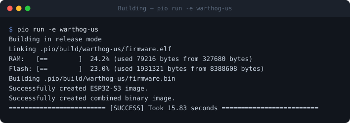
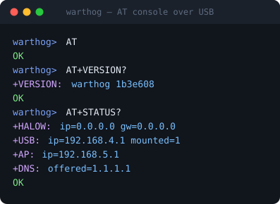
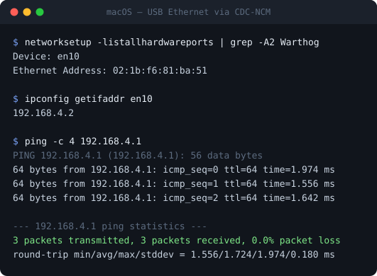
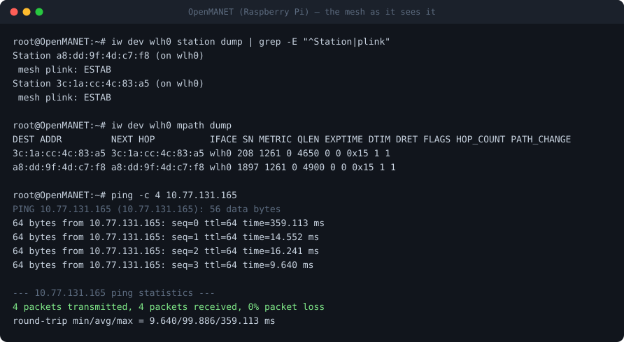

# Warthog

```
           .                   .
           .        :      ----::
           .        :...........:-:.-..:-
           .            :.--.:-::
           .            :..-....:
           .              ...:  :::
           .            .:...:-..:::.-------:--:.--::-.
           .           -...-.:.:...             ::..:......::..
    .:..:::-         :..-.-...-...:.         :. .-:...:::::::::-::...::.
    .:.::::--..:................:.:          :..............:.:-------:: .
     .-::::-..:-........::::..:----.:     ::...----:....-..::--:.......-::
        -----:---------:..:..:.......--:------.......::..:.---.........:.:
        :.....:---:----..:..:..::..................-...-:-...:---:-:.....--
       ...---.::---::.---:..-::...---------------....--.:..-.::-----.-...--.
        .  -::.......::--:.-..:-:...:..........:...-:.-..--:-.......:.--:.-
          ::-.........-::...-:......-..........-:...::...::-.........-:.
          :.-.........:.:      :-------------------.     :.:............
          :..:........:.:                                ..:.........-.:
           ..:-.....-:::                                  :.:-.....-:.:
             :::.:.:.-                                      ::..:.:.-
```

> **Warthog** — open-source firmware turning an ESP32-S3 + Wi-Fi HaLow module into a long-range USB Ethernet and 2.4 GHz Wi-Fi AP gateway you can hack.

Plug it into a laptop and the host gets a USB Ethernet adapter. Join the side-car 2.4 GHz Wi-Fi AP from a phone or IoT client and you share the same uplink. Both surfaces are NAT'd out a sub-GHz 802.11ah HaLow link with kilometer-class range. A CDC-ACM console exposes an AT-command surface for runtime reconfig without reflashing.

## Features

- USB **CDC-ECM** network adapter for the host (macOS / Linux native; Windows-RNDIS is a roadmap item)
- Secondary **2.4 GHz Wi-Fi AP** for clients that can't (or shouldn't) be wired
- **HaLow STA uplink** via Morse Micro MM6108 / Quectel FGH100M-H — kilometer range at low power
- **lwIP NAPT** bridges both downstream surfaces out HaLow
- USB **CDC-ACM** console with mirrored ESP-IDF logs and an **AT command** surface for runtime SSID/PSK changes
- NVS-persisted credentials — no reflashing to retarget the uplink
- Per-region release builds (US / EU / JP / KR / AU), BCF + country code baked in at compile time
- Built on **ESP-IDF 5.5 + TinyUSB + `morsemicro/halow`**

## Documentation

Full guides live in the [wiki](../../wiki) — quick start, flashing, each
operating mode, the AT reference and troubleshooting. Deep technical notes are
versioned alongside the code in [`docs/`](docs/).

## Operating modes

Warthog is not one device role. A node runs an **uplink** and presents
**downstream surfaces** to whatever is plugged into or associated with it.

```
        ┌──────── downstream ────────┐        ┌──── uplink ────┐

  laptop ──USB──▶ CDC-ECM ┐
                          ├─▶ NAPT ─▶ HaLow ─▶  AP  (station mode)
  phone  ──WiFi─▶ 2.4 AP  ┘                or  mesh (802.11s peers)
```

| Mode | What it does | Chosen |
|---|---|---|
| **Host** | Gives the machine it is plugged into a USB Ethernet adapter (`192.168.4.1/24`) | always on |
| **Client** | 2.4 GHz AP so phones and IoT clients share the uplink (`192.168.5.1/24`) | always on |
| **Station uplink** | Joins an existing HaLow access point | default builds |
| **Mesh uplink** | 802.11s peer-to-peer, no infrastructure | `AT+MESHEN=1` on any build; `warthog-mesh-sae` for SAE/AMPE |

Both downstream surfaces are live at once. The two uplink modes are mutually
exclusive; which one runs is a runtime setting (`AT+MESHEN`), as are the mesh
ID, passphrase and channel. Whether the build speaks SAE/AMPE at all is still
chosen at build time.

### Warthog is a mesh leaf, not a relay

> **Unless `AT+MESHFWD=1`.** Forwarding mode relays path selection and data
> for other nodes and advertises the capability; it is implemented,
> host-tested and simulated, and has not been on a radio. See
> [Mesh Mode](wiki/Mesh-Mode.md#forwarding). This section describes the
> default.

A Warthog joins a mesh and talks to its peers. It does **not** forward frames
between two other nodes, so it cannot extend a mesh's reach — a Warthog placed
between two nodes that cannot hear each other does not connect them.

This is absent at every layer, not merely unverified: the RX data path
delivers to the local host or drops, with no branch that re-enqueues a frame
whose mesh destination is somebody else; the Mesh Control TTL is written on
transmit and never read or decremented on receive; and the multicast repeater
explicitly refuses to re-send a datagram out the interface it arrived on
(`main/mudp.c`).

If you need a relay — an airborne node extending coverage, for instance —
that is 802.11s HWMP forwarding, and it is not built yet. See
[`docs/mesh-attachment-model.md`](docs/mesh-attachment-model.md).

### Warthog routes, it does not bridge

> **Unless `AT+MESHBRIDGE=1`.** Bridge mode puts USB, the Wi-Fi AP and the
> mesh on one L2 segment and turns NAT off; it exists precisely to remove the
> limitations below, and it is compiled but not yet measured on air. See
> [Mesh Mode](wiki/Mesh-Mode.md#bridge-mode). Everything in this section
> describes the default, NAT mode.

Every surface is its own IP subnet and Warthog NAPTs between them
(`main/nat.c`). The tethered host is **not** on the same layer-2 segment as
anything upstream, and that has consequences worth knowing before you design
around it:

- **Link-local and broadcast discovery does not cross Warthog.** mDNS/DNS-SD,
  SSDP, NetBIOS and anything else that finds peers by broadcasting on the
  local segment will not see devices on the other side.
- **Multicast does not cross either, with one exception.** A small
  application-layer repeater (`main/mudp.c`) forwards exactly one group —
  Meshtastic's `239.0.0.69:4403` — between the USB, AP and HaLow netifs.
  Nothing else is repeated.
- **ATAK / CoT multicast discovery on `239.2.3.1:6969` will not work**, and
  adding it to the repeater would not fix it. Every Warthog NATs its tethered
  host to the same addresses — `WARTHOG_USB_GW_IP` is the compile-time constant
  `192.168.4.1` on every unit — so two hosts on opposite sides of a mesh are
  both `192.168.4.x`. A CoT event carries the sender's address in its payload,
  so repeating the group would deliver a contact whose address, on the
  receiver's side, is the receiver's own subnet. That is worse than not
  finding each other: it is finding each other wrongly. The same applies to
  mDNS/SD, whose A records would advertise unroutable addresses.

  Point-to-point CoT to a known, routable address still works; discovery does
  not. What fixes it is one L2 segment with unique host addresses — bridging
  rather than NAT — which is what `AT+MESHBRIDGE=1` now provides (compiled,
  not yet measured on air), not a bigger repeater.
- **Inbound connections need explicit forwarding.** Upstream devices cannot
  reach the tethered host by address, because it is behind NAT.

If your application depends on layer-2 adjacency or broadcast discovery, this
is the limitation to design around — use known addresses, a server both sides
reach, or an overlay (see [Security](#security)).

## USB setup, end to end

Three commands from a fresh checkout to a working link. The screenshots below
are real sessions against an attached board, regenerated by
`scripts/regen-screenshots.sh`.

### 1. Build

```bash
pio run -e warthog-us
```



### 2. Flash

**No toolchain?** Use the [web flasher](https://thebentern.github.io/warthog/) —
Chrome, Edge or Opera, no install. It also has a Configure tab that drives the
same AT commands from the browser.

The HaLow add-on drives USB-OTG, so `esptool` cannot pull the board into
download mode over DTR/RTS. Do it by hand — **hold BOOT, tap RESET, release
BOOT** — then:

```bash
pio run -e warthog-us -t upload
```

Tap **RESET** when it finishes.

### 3. Talk to it

A CDC-ACM console appears as `/dev/cu.usbmodem*` (macOS) or `/dev/ttyACM*`
(Linux). Any terminal at 115200 8-N-1:



`AT+STATUS?` reports every surface at once: the HaLow uplink, the USB network,
the Wi-Fi AP, and the DNS handed to downstream clients.

### 4. Use the network

The same cable also presents a **USB Ethernet adapter**. The host picks up a
DHCP lease from the board and can route out over HaLow:



That is a stock macOS driver binding a stock USB class — nothing to install.

## Connecting phones and tablets

The USB surface presents **CDC-NCM**, which every current host binds with an
in-box driver — macOS, Linux, Windows 10+ and iOS/iPadOS. The class matters far
more than the cable:

| Client | Over USB | Over the Wi-Fi AP |
|---|---|---|
| macOS laptop | ✅ verified — DHCP lease, 300/300 at 1400 B, ~1.5 ms | ✅ |
| Linux laptop | ✅ expected — `cdc_ncm` in-tree since 2.6.38 (not re-verified) | ✅ |
| Windows laptop | ✅ expected — `usbncm.sys` in box on Windows 10+ (untested) | ✅ |
| iPhone / iPad | ✅ expected — Apple's in-box NCM driver, no dext or MFi (untested here) | ✅ |
| Android phone/tablet | ⚠️ untested — needs USB host mode; also has to power the board | ✅ recommended |

### Why an iPad works over USB now

warthog used to present CDC-ECM, which macOS and Linux bind and iOS does not —
so a cable to an iPad did nothing. It now presents **CDC-NCM**, the class Apple
binds with its own driver: no dext, no MFi, and it works in airplane mode
because the link is not a radio.

Two things that made this work, both easy to get wrong:

- **TinyUSB must resolve to >= 0.21.0**, pinned in `main/idf_component.yml`.
  `esp_tinyusb` alone only asks for `>= 0.17.0~2`, so the resolve was landing
  on 0.19.0 by luck; below 0.21.0 the NCM control requests are unreliable.
- **The configuration descriptor is built by `esp_tinyusb`, not by hand.** A
  hand-rolled composite serves ECM fine and is rejected outright for NCM, in a
  way that looks like dead hardware: the device still answers its device and
  string descriptors, so it appears in a hub listing with the right name while
  the host never creates a device for it.

Two caveats that remain:

1. **The phone has to be the USB host** — OTG mode, a suitable adapter, and the
   phone supplies the power. The HaLow PA needs a bulk capacitor even from a
   laptop port ([`docs/power-notes.md`](docs/power-notes.md)); a phone port is a
   worse supply.
2. **Two warthogs on one host collide.** Both vend `192.168.4.1/24`, so a host
   with two attached configures only one and the other falls back to a
   link-local address.

If you meet a host that binds ECM and not NCM, `warthog-us-ecm` builds the old
class as a fallback.

## How Warthog compares

There are off-the-shelf HaLow USB adapters that just work — Heltec HT-HD01 V2, Alfa Network AHUS-1, Vantron's MM8108 dongles. If you need a HaLow uplink for a laptop today and don't want to think about firmware, **buy one of those.** They're vendor-supported and require zero assembly.

Warthog is for a different audience: people who want to *own* the firmware on a HaLow gateway and ship custom behavior on top.

| | Commercial dongles (Heltec / Alfa / Vantron) | Warthog |
|---|---|---|
| Firmware | Closed, vendor binary | **Open source** (GPL-3.0); ESP-IDF + TinyUSB + `morsemicro/halow` |
| Hardware | Pre-built USB stick | XIAO ESP32-S3 + Seeed HaLow add-on (~$30 BOM) — needs a [bulk-cap mod](docs/power-notes.md) on this specific board |
| Host surface | USB Ethernet only | USB CDC-ECM **+** CDC-ACM console **+** 2.4 GHz Wi-Fi AP |
| Runtime config | Vendor app or fixed defaults | **AT commands** over the CDC port (`AT+HALOW=ssid,psk`), NVS-persisted |
| Secondary clients | Need their own USB host | Join the Wi-Fi AP — no USB required |
| Region story | Vendor-locked, opaque | Per-region build artifacts; BCF + country code explicit at compile time |
| Customization | Whatever the vendor shipped | Drop in additional USB classes, telemetry over CDC, MQTT bridge, web UI — it's just an ESP-IDF project |
| Docs | Datasheet | The gotchas captured: power delivery, NAPT inversion, USB-OTG handoff (see `docs/`) |

**Short version:** want a HaLow USB adapter today? Buy a dongle. Want a hackable HaLow + USB + Wi-Fi AP gateway with an AT control plane on hardware you understand? Build Warthog.

## Hardware

Tested target:

- [Seeed Studio XIAO ESP32-S3](https://www.seeedstudio.com/XIAO-ESP32S3-p-5627.html)
- [Seeed Studio Wi-Fi HaLow module for XIAO](https://www.seeedstudio.com/Wi-Fi-HaLow-Module-for-Seeed-Studio-XIAO-p-6262.html) (Quectel FGH100M-H, MM6108)
- External 900 MHz antenna via I-PEX → SMA pigtail

> ⚙️  **Required mod for this combo:** the Seeed add-on routes the FGH100M-H's PA supply (`VDD_FEM`) straight to USB VBUS with only 20 µF of bulk capacitance. The radio's turn-on inrush collapses the rail under PA load and the ESP32-S3 `POWERON`-resets. Add a **470–1000 µF / ≥ 10 V** low-ESR cap across the XIAO's 5V ↔ GND pads before flying. Full diagnosis + waveform reasoning in [`docs/power-notes.md`](docs/power-notes.md).

## Releases

Tagged releases ship per-region binary bundles on the [GitHub releases page](../../releases). Each bundle contains:

| File | Purpose |
|------|---------|
| `warthog-vX.Y.Z-REGION.factory.bin` | Single-shot flash: bootloader + partitions + app, write to offset `0x0` |
| `warthog-vX.Y.Z-REGION.bin` | App-only image (e.g. for OTA), write to `0x10000` |
| `warthog-vX.Y.Z-REGION.elf` | Debug symbols (for `addr2line` against a panic backtrace) |
| `warthog-vX.Y.Z-REGION-{bootloader,partitions}.bin` | Components if you want to flash piecewise |
| `flash.sh` | POSIX shell flasher (auto-detects port, wraps `esptool`) |
| `SHA256SUMS.txt` | Covers every asset in the release |

Hold the XIAO's **BOOT** button, tap **RESET**, release BOOT to enter download mode, then:

```bash
./flash.sh warthog-v0.1.0-us.factory.bin
```

Tap RESET on the XIAO when it finishes.

## Build & flash

Build for your region:

```bash
pio run -e warthog-us       # United States (902–928 MHz)
pio run -e warthog-eu       # Europe (863–868 MHz)
pio run -e warthog-jp       # Japan (916.5–927.5 MHz)
pio run -e warthog-kr       # Korea (917.5–923.5 MHz)
pio run -e warthog-au       # Australia
pio run -e warthog-mesh-smoke   # 802.11s mesh (see Mesh mode below)
```

Flash (XIAO + HaLow uses USB-OTG, so the auto-reset path is gone — hold **BOOT**, tap **RESET**, then run):

```bash
pio run -e warthog-us -t upload
pio device monitor -e warthog-us
```

Configure HaLow credentials at build time:

```bash
pio run -e warthog-us \
  -DHALOW_SSID=\"MyHaLowAP\" -DHALOW_PASSPHRASE=\"secret\"
```

Other build-time defaults you can override the same way (all live in `[warthog_base]` in `platformio.ini`):

| Macro | Default | What it controls |
|---|---|---|
| `WARTHOG_AP_SSID` | `warthog` | 2.4 GHz AP SSID |
| `WARTHOG_AP_PSK` | `warthog-default` | 2.4 GHz AP WPA2 passphrase |
| `WARTHOG_USB_GW_IP` / `_NETMASK` | `192.168.4.1/24` | USB ECM subnet (host gets `.2+`) |
| `WARTHOG_AP_GW_IP` / `_NETMASK` | `192.168.5.1/24` | Wi-Fi AP subnet |
| `WARTHOG_DOWNSTREAM_DNS` | `1.1.1.1` | DNS handed to USB + AP clients via DHCP option 6. See [Troubleshooting](#troubleshooting) — getting this wrong is what makes `ping 8.8.8.8` work while `curl example.com` hangs. Override with `AT+DNS=` at runtime instead of reflashing. |

These are compile-time defaults only; everything in NVS (HaLow creds, AP creds, DNS — see AT commands below) wins over them at boot.

## Runtime configuration (AT commands)

The CDC-ACM port (`/dev/cu.usbmodemXXXX` on macOS) accepts AT commands so you don't have to reflash to change credentials. Connect with any serial terminal at 115200 8-N-1 (baud is ignored by CDC):

```
AT                          → OK
AT+VERSION?                 → +VERSION: warthog 0.1.0-dev / OK
AT+STATUS?                  → +HALOW: ip=... / +USB: ip=... mounted=1
                              +AP: ip=... / +DNS: offered=1.1.1.1 / OK
AT+HALOW=MyAP,secret        → store HaLow creds in NVS; AT+RESET to apply
AT+HALOW?                   → +HALOW: ssid="MyAP" (psk hidden) / OK
AT+WIFIAP=warthog,xyz,11    → change AP SSID/PSK/channel
AT+WIFIAP?                  → +WIFIAP: ssid="warthog" chan=6 (psk hidden) / OK
AT+MESHEN=1                 → join a mesh instead of a HaLow AP; AT+RESET to apply
AT+MESHID=halowmesh         → mesh ID, must match every peer exactly
AT+MESHPASS=secret          → SAE passphrase (SAE builds); length-only readback
AT+MESHCHAN=42,923000000,69,2,2
                            → pin the S1G channel as a set; region builds ship unpinned
AT+MESHCFG?                 → everything a peer matches on, plus what Warthog won't do
AT+DNS=8.8.8.8              → set the DNS handed to USB + AP clients via DHCP
AT+DNS?                     → +DNS: 1.1.1.1 / OK
AT+RESET                    → reboot
AT+ERASE                    → wipe NVS warthog namespace
```

`AT+DNS=` validates the input via `inet_pton`; malformed addresses (`AT+DNS=garbage`, `AT+DNS=1.2.3`, `AT+DNS=0.0.0.0`) come back as `+ERR: not a valid IPv4 address` / `ERROR` without touching NVS. To revert to the build-time default (`WARTHOG_DOWNSTREAM_DNS`), run `AT+ERASE` — that wipes the whole namespace including HaLow / AP creds, so you'll re-enter those too.

Credentials and the custom DNS live in NVS namespace `warthog`. On boot, `halow.c`, `wifi_ap.c`, and `usb_net.c` read NVS first and fall back to the `-DHALOW_SSID=...` / `-DWARTHOG_AP_SSID=...` / `-DWARTHOG_DOWNSTREAM_DNS=...` build flags only if the NVS entry is absent.

## Mesh mode (802.11s)

Instead of associating to an access point, a node can join an 802.11s mesh over
HaLow. Every node is a peer — nothing to elect, nothing to associate to, and a
node that loses power takes only its own links with it.

```bash
pio run -e warthog-mesh-sae -t upload      # encrypted: SAE auth + AMPE per-link keys
pio run -e warthog-mesh-smoke -t upload    # open: for stock (unencrypted) OpenMANET
```

The encrypted build runs real 802.11s security — SAE authentication
(Dragonfly, group 19) and AMPE key exchange, with per-link pairwise and group
keys installed in the radio. All nodes share one passphrase: `AT+MESHPASS=` at
runtime, defaulting to the build's `WARTHOG_MESH_PASSPHRASE` (`warthog-mesh`)
until one is set. Peering, keying and addressing are automatic.

Nodes address themselves statically from their own MAC — `10.77.<mac[4]>.<mac[5]>/16`
— so `3c:1a:cc:4c:83:a5` is `10.77.131.165`. There is no DHCP on the mesh.

```
AT+MPMPEERS?                     peers, handshake state, AMPE key counters
AT+SAERX?                        SAE/peering state machine (encrypted build)
AT+MESHSEC=0                     open data plane (open build, unencrypted peers)
AT+MPING=10.77.199.248,4         confirm data
```

### Interoperating with OpenMANET / OpenWrt

Warthog meshes with Linux `mac80211` peers. Verified against OpenMANET 1.8.0 on
a Raspberry Pi 4 with a Seeed HaLow HAT, meshing with two Warthog nodes at once —
0–3% loss, 8–19 ms round trip, with the peer in its stock configuration.

What the OpenMANET side sees once a warthog has joined — established peer
links, resolved paths at hop count 1, and answered pings:



**The use case** is hanging phones and EUDs off your mesh: a warthog
joins as a peer and presents a Wi-Fi AP and a USB Ethernet adapter on the other
side. That story, end to end, is in the wiki:
[OpenMANET Gateway](../../wiki/OpenMANET-Gateway).

Two OpenWrt defaults will stop it dead, each with no error message: the mesh
interface is bridged into `br-lan`, and unbridging it drops it out of the `lan`
firewall zone. Both are covered, with the diagnostic signature of each, in
[`docs/mesh-openmanet.md`](docs/mesh-openmanet.md).

## Troubleshooting

### "`ping 8.8.8.8` works but `curl example.com` hangs"

A DHCP-DNS gap: ICMP to a numeric IP returns within ~90 ms (HaLow RTT), but name resolution stalls.

**Cause.** The Warthog DHCP server has to hand the host a DNS resolver via DHCP option 6, *and* that resolver has to be reachable through the NAT chain. Two ways that breaks:

1. **No DNS option** — the host gets only IP + gateway, falls back to its primary-interface resolver (usually a `192.168.x.1` or `10.x.x.1` from Wi-Fi), and tries to query that LAN IP through the Warthog USB tunnel. The LAN IP isn't reachable through HaLow's NAT, so DNS just times out.
2. **DNS option present but unroutable** — the upstream HaLow AP's DHCP lease hands the ESP32 a *LAN-side* resolver (e.g. on a HaLowLink 2, `192.168.12.1`). Re-advertising that address to downstream USB clients makes the host NAPT its DNS queries through HaLow toward `192.168.12.1` — which the upstream AP only answers for clients on its own subnet, not for NAT'd traffic. Same hang.

**Fix.** Warthog hands out a *publicly reachable* resolver instead. Default is **`1.1.1.1`** (Cloudflare) — works through any NAT chain, no LAN dependency. Override at runtime to use a different public resolver or a private one reachable from the upstream network:

```
AT+DNS=8.8.8.8
AT+RESET
```

…or at build time, e.g. for a fleet that ships pointed at a Pi-hole on the upstream LAN:

```bash
pio run -e warthog-us -DWARTHOG_DOWNSTREAM_DNS=\"10.0.0.53\"
```

**Verify on macOS** (after reflash + fresh DHCP lease):

```bash
ipconfig getpacket en10 | grep domain_name_server
# Expected: domain_name_server (ip_mult): {1.1.1.1}
```

If the firmware advertises the right DNS but the host still uses the old one, force a new lease: `sudo ifconfig en10 down && sudo ifconfig en10 up`, or unplug and replug the cable. macOS caches the original lease for hours otherwise.

**Implementation note.** Advertising DHCP option 6 requires *two* ESP-IDF calls per netif (USB and Wi-Fi AP), not one:

```c
dhcps_offer_t offer_dns = OFFER_DNS;
esp_netif_dhcps_option(netif, ESP_NETIF_OP_SET,
                       ESP_NETIF_DOMAIN_NAME_SERVER,
                       &offer_dns, sizeof(offer_dns));   /* enable option 6 emission */
esp_netif_set_dns_info(netif, ESP_NETIF_DNS_MAIN, &dns); /* set the IP to advertise */
```

`esp_netif_set_dns_info` alone is not sufficient: it stores the address in the dhcps struct, but lwip's dhcpserver only includes option 6 in offers when the `dhcps_dns` enable bit is set, which defaults to `0x00`. Without the `dhcps_option(OFFER_DNS)` call the address is silently never advertised. See `main/usb_net.c` and `main/wifi_ap.c`.

### Debug logging

Verbose runtime diagnostics are gated behind a single build flag so production logs stay quiet. Enable for a debug build:

```bash
PLATFORMIO_BUILD_FLAGS="-DWARTHOG_DEBUG=1" pio run -e warthog-us -t upload
```

That switches on:

- `warthog.nat: tick: halow_ip=… usb.napt=1 ap.napt=1 default=…` every 30 s — confirms the NAPT supervisor is enforcing state.
- `warthog.nat: HaLow STA IP changed: X -> Y (NAPT table now stale; downstream clients will see drops)` — fires on STA re-association with a new IP, the usual cause of downstream clients losing internet after a few minutes.
- New diagnostic blocks should be gated behind the same `#if WARTHOG_DEBUG`, keeping a single knob.

### When in doubt

The CDC console (`/dev/cu.usbmodemXXXX`) carries all ESP-IDF logs after USB-OTG takes over, and `AT+STATUS?` gives a one-shot view of every netif's IP plus the currently-offered DNS. Known failure modes and their diagnostic signatures are documented in `docs/` (`power-notes.md`, `napt-notes.md`).

## Status

| Phase | Description | Status |
|-------|-------------|--------|
| 0 | Repo skeleton + PlatformIO/IDF build | ✅ |
| 1 | HaLow STA bring-up | ✅ SAE association + DHCP lease verified against a HaLowLink 2 |
| 2 | USB net device (CDC-ECM, macOS/Linux) | ✅ DHCP + ping verified on macOS |
| 3 | 2.4 GHz Wi-Fi AP | ✅ SSID `warthog` visible |
| 4 | lwIP NAPT bridge | ✅ end-to-end internet verified (host → USB → HaLow → upstream → 8.8.8.8) |
| 5 | Polish (LEDs, AT, NVS) | ✅ partial — LED state machine, AT commands, NVS persistence shipped. Windows RNDIS, NCM (iOS) and a web UI deferred. |
| 6 | 802.11s mesh over HaLow | ✅ peering, data plane and HWMP path selection; 3-node warthog mesh verified |
| 7 | OpenMANET / OpenWrt interop | ✅ unencrypted mesh: 0–3% loss, 8–19 ms against OpenMANET 1.8.0. SAE/AMPE peering also verified cross-vendor; its data plane is not — see [`docs/mesh-openmanet.md`](docs/mesh-openmanet.md) |
| 8 | 802.11s forwarding + L2 bridge | 🧪 implemented, host-tested and simulated (`sim_mesh`: relay, flood, proxy, link loss, TTL); **no forwarded or bridged frame has been on a radio** — see [Mesh Mode](wiki/Mesh-Mode.md#forwarding) |

SAE/AMPE is implemented: the `warthog-mesh-sae` build derives a per-link MTK
per peer, and peering interoperates with stock OpenMANET. One limit applies:
the **encrypted** data plane is warthog-to-warthog only — against OpenMANET the
verified result is the unencrypted mesh above, because the chip holds one
VIF-wide group key while every 802.11s peer generates its own, so
group-addressed frames from a second peer cannot be decrypted in hardware.

Mesh is no longer confined to the capability builds: `AT+MESHEN=1` enables it
on any image, region envs included, and the mesh ID, passphrase and channel are
runtime settings. The mesh envs remain useful because they pin a channel and
fix the identity at build time.

Implemented but not measured on air: 802.11s forwarding (`AT+MESHFWD=1` — path
selection relayed, unicast and group data relayed, proxied endpoints learned,
link loss announced; host-tested and simulated, see [Mesh Mode](wiki/Mesh-Mode.md#forwarding)).

Implemented but not measured on air, likewise: L2 bridge mode (`AT+MESHBRIDGE=1`
— USB, Wi-Fi AP and mesh as one segment, NAT off; builds on every env with the
lwIP bridge compiled in, has not carried a packet).

Not implemented: per-transmitter group keys, multicast across the mesh on a
leaf, Windows RNDIS, and a web UI.

### What is measured, and what is not

The ✅ above means "observed on hardware", and it is worth being precise about
when, because a large amount of the current tree has not been on a radio.

**Measured on hardware.** Phases 0–5 as described. A 3-node warthog 802.11s
mesh, and cross-vendor SAE/AMPE peering to an OpenMANET node, on 2026-09-20.
The unencrypted data-plane figures in phase 7, against OpenMANET **1.8.0**. On
2026-09-21, an OpenMANET **24.10** (`r28739-d9340319c6`) baseline: the peer's
mesh configuration, the absence of a batman fabric on an un-wizarded node, and
proxied endpoints crossing the mesh on air.

**Not measured.** Everything added on 2026-09-21 is compiled, reviewed and
where possible host-tested, but has not run on a radio: receive-side Address
Extension against a real bridged peer, DHCP-first netif bring-up, runtime
channel configuration on a region build, per-peer RSSI/SNR/bandwidth, the
`fwdcand` forwarding-feasibility counter, the peering watchdog's output
(its cause-selection is unit-tested on the host; its log lines have never
fired on hardware), and the whole of 802.11s forwarding — every decision in
it is host-tested and a multi-node simulator drives the shipping code through
relay, flood, proxy, link-loss and TTL scenarios, but no forwarded frame has
been on a radio, and whether the chip delivers third-party frames to the host
at all is the `fwdcand` question above. Host software CCMP has **never been observed working on
air** — `swccmp ok` has not been seen above zero, for unicast or group. That
802.11w MFP is negotiated and the IGTK installed is readable from the source
and the linked image; that the chip applies BIP on air is not.

**What the unmeasured receive-side work does to the measured path.** A
previous revision of this paragraph claimed warthog never emits a Mesh Control
field, so its own frames could never enter the new receive code. That was
wrong: every mesh data frame warthog transmits carries a 6-byte Mesh Control
(`umac_datapath.c`, "Mesh Control Present" — measured, the peer's MM6108 drops
4-address data without it). So warthog-to-warthog frames DO take the
`mesh_ctrl_present` branch. What that branch does to them is the pre-existing
6-byte strip plus three additive counters; the Address Extension capture only
fires when the sender set AE flags, which warthog does not. The 3-node result
from 2026-09-20 was measured with that strip already in place. The exposure is
therefore the counters and the AE parse on foreign frames, not the strip.

If you are deciding whether to trust this for something that matters, the
not-measured paragraph is the honest answer.

## Security

**Treat the mesh as an untrusted transport and protect traffic above it.** That
is not a placeholder caveat; it follows from how 802.11s works and from what
this firmware currently ships.

### 802.11s SAE is hop-by-hop, never end-to-end

SAE authenticates a *link*. Each mesh hop decrypts a frame and re-encrypts it
for the next hop, so every node a packet traverses sees it in the clear. A
mesh is a group of peers that all hold the same passphrase, which means:

- **No per-node identity.** Possession of the passphrase is the whole
  credential. Any device holding it is a full member.
- **No revocation.** Removing a node means changing the passphrase on every
  other node. On Warthog that is `AT+MESHPASS=` plus a reboot per node — no
  reflash — but it is still every node, and there is no way to exclude one
  device without re-keying all the others.
- **Any member can decrypt anything traversing it.** A compromised or captured
  node reads all traffic routed through it, and can inject.

This is a property of 802.11s, not a Warthog limitation. OpenMANET nodes on the
same mesh are in exactly the same position.

### What each mode actually gives you

| Mode | Peering | Data plane | Use |
|---|---|---|---|
| Default mesh build | open, unauthenticated | cleartext | interop testing; this is what talks to stock OpenMANET today |
| `AT+MESHSEC=1` | open, unauthenticated | CCMP under a **public constant** | exercising the CCMP path only |
| `warthog-mesh-sae` | SAE (Dragonfly) | CCMP under a per-link AMPE MTK | the only mode with real link security |

The `AT+MESHSEC=1` key is `00 11 22 33 … ff` — a counting sequence compiled
into every Warthog image. It is not a secret, anyone with the firmware has it,
and it exists only so the CCMP data path can be exercised. It also cannot
interoperate: a peer deriving real keys can neither read those frames nor be
read by them.

### The default SAE passphrase is in the binary

The passphrase is a runtime setting — `AT+MESHPASS=<pass>` stores it in NVS and
it takes effect on the next boot. `AT+MESHPASS?` reports its length and never
its value.

What is in the binary is the *default*: `WARTHOG_MESH_PASSPHRASE`, which is
`warthog-mesh` unless the build overrides it. A node that has never been given
a passphrase is therefore on a passphrase that anyone holding the image knows.
Set one before deploying, and treat a published or shared image as a published
default. The build-time override still exists if you would rather ship images
that are safe before they are configured:

```bash
pio run -e warthog-mesh-sae --build-flag='-UWARTHOG_MESH_PASSPHRASE' \
                            --build-flag='-DWARTHOG_MESH_PASSPHRASE=\"your-passphrase\"'
```

### Management frame protection (802.11w)

MFP is negotiated on the SAE build. The mesh join path sets PMF to *required*
(`umac/supplicant_shim/config.c:452`), which is what mac80211 and hostap do for
a secured mesh, so the RSN capabilities Warthog advertises match what an
OpenMANET peer expects. hostap's `mesh_rsn` generates a TX IGTK and installs it
through the driver shim as `WPA_ALG_BIP_CMAC_128`, the shim handles that
algorithm (`umac/supplicant_shim/driver.c:879`), and the BIP primitives are
linked into the image. Warthog's AMPE parser accounts for the peer's IGTK when
the peer advertises MFP capable and required (`umac/mesh/umac_mesh.c:1105`).

**Not measured.** That the key is generated, installed and negotiated is
readable from the source and the linked image. Whether the MM6108 actually
applies BIP to robust management frames on air has never been observed here —
it is the same open question as the group CCMP key, and it needs a radio and a
peer to answer.

### For anything that actually needs confidentiality

Run an end-to-end tunnel over the bridged segment and let the mesh be plumbing:

- **WireGuard** between the endpoints that matter — per-peer keys, real
  identity, revocation by removing a key.
- **Reticulum** if you want end-to-end encryption plus its own routing over a
  transport you do not trust.

Either gives you the per-node identity and revocation that 802.11s SAE
structurally cannot.

## Licensing

Warthog's own code is **GPL-3.0-or-later** (see [`LICENSE`](LICENSE)).

It vendors the Morse Micro IoT SDK under `components/halow/`, which is **not**
all GPL and is not warthog's to relicense. What is in the tree:

| Component | Licence | Notes |
|---|---|---|
| Warthog firmware (`main/`, mesh port, tests) | GPL-3.0-or-later | This project |
| Morse Micro SDK sources | `GPL-3.0-or-later OR LicenseRef-MorseMicroCommercial` | Dual; distributed here under the GPL branch |
| Third-party SDK components | Apache-2.0, MIT, BSD-3-Clause, GPL-2.0-or-later, Zlib | Per-file SPDX headers |
| HaLow firmware and board-config blobs (`*.mbin`) | `LicenseRef-MorseMicroBDL` | Binary Distribution Licence |

Full licence texts are in
[`components/halow/components/mm-iot-sdk/LICENSES/`](components/halow/components/mm-iot-sdk/LICENSES/).

The firmware blobs are redistributed **complete and unmodified**, which is what
the Morse Micro Binary Distribution Licence permits, and solely for use with
hardware containing a Morse Micro HaLow chip. If you fork this repository, keep
them unmodified and keep the `LICENSES/` directory with them. Do not assume the
GPL applies to the blobs — it does not.

## Regulatory

The radio's regulatory domain is fixed at build time by the region env you
choose (`warthog-us`, `-eu`, `-jp`, `-kr`, `-au`), which selects both the board
config and the channel list. **Build the env for the jurisdiction you are
operating in.** Transmitting on another region's channel plan is very likely
illegal where you are, and sub-GHz spectrum differs sharply between regions.

Warthog is an experimental project. You are responsible for operating it within
your local rules, including duty-cycle and transmit-power limits.

