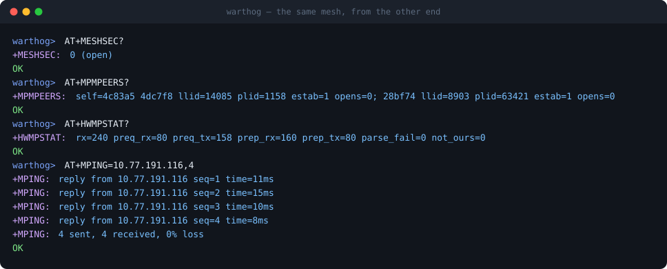

# 802.11s mesh, and interoperating with OpenMANET / OpenWrt

Warthog can join an 802.11s mesh over HaLow instead of associating to an AP.
Every node is a peer: there is no gateway to elect, no association, and a node
that powers off takes only its own links with it.

This document is the setup procedure, the settings that must match, and the
failure modes — all of it measured against OpenMANET 1.8.0 on a Raspberry Pi 4
with a Seeed HaLow HAT, and two Warthog nodes.

Verified result against a peer hand-configured as an open mesh
(`encryption='none'`, mesh ID `halowmesh`; not the stock or wizard
configuration):

| Direction | Result |
|---|---|
| OpenMANET → Warthog A | 29/30, 3% loss, 8.9 / 19.3 ms |
| OpenMANET → Warthog B | 30/30, 0% loss, 8.6 / 15.2 ms |
| Warthog → OpenMANET | 8/8, 0% loss, 8 / 19 ms |
| Warthog ↔ Warthog | 6/6, 0% loss, ~15 ms |

Encrypted, against OpenMANET 1.8.0 Pis on their SAE mesh (`ieee80211w=2`),
2026-09-29/30: `warthog-mesh-sae-swccmp` in batman mode, the Pis' `bat0` set up
by hand. Host CCMP opened the Pis' group frames and unicast, and once the
Warthog took their protected group PREQs the Pis held `ACTIVE` paths to it:
pings from a host on a Pi's LAN, `batctl ping` from a Pi, and DHCP leases from
a Pi, with small frames (`wiki/Batman-Mode.md`, *Measured on air*). A Pi's
unicast above about 1000 bytes arrives from every Pi only on
`warthog-mesh-sae-swccmp-meshvif` or with a setting on the Pi; on other builds
only from the Pi the chip registered last (*Troubleshooting*).

## Build and flash

`AT+MESHEN=1` puts any build in mesh mode (stored; applied on the next boot).
This env starts in it:

```bash
pio run -e warthog-mesh-smoke
```

That env pins the radio to a single S1G channel and sets the mesh identity, so
every node agrees without any runtime configuration. The values that must match
across the whole mesh are compile-time defaults in `platformio.ini`;
`AT+MESHID=` and `AT+MESHCHAN=` override the first five at runtime (stored;
applied on the next boot):

| Flag | Default | Must match peers |
|---|---|---|
| `WARTHOG_MESH_ID` | `halowmesh` | yes |
| `WARTHOG_PIN_S1G_CHAN` | `42` | yes |
| `WARTHOG_PIN_S1G_FREQ_HZ` | `923000000` | yes |
| `WARTHOG_PIN_S1G_BW_MHZ` | `2` | yes |
| `WARTHOG_PIN_S1G_GLOBAL_OP_CLASS` | `69` | yes |
| `WARTHOG_MESH_BEACON_TU` | `1000` | no |

S1G channel 42 at 2 MHz is what Warthog pins by default. Verify your peer's
actual channel (`morse_cli -i wlh0 channel`) and match it; do not assume.
Change any of the first five and you must change them on every node, Warthog and
Linux alike — a mismatch produces a silent non-event, not an error. The
OpenMANET mesh wizard defaults to mesh ID `openmanet` and passphrase
`changeme123`; set `AT+MESHID=` (and `AT+MESHPASS=` on the SAE build) to what
the peer actually runs.

Flash as usual (hold **BOOT**, tap **RESET**, release BOOT):

```bash
pio run -e warthog-mesh-smoke -t upload
```

A board already running Warthog needs no buttons: send `AT+DLMODE`, then flash
the ROM port it re-enumerates as (`303a:0009`) with esptool's
`--before no-reset --after watchdog-reset` (`wiki/Flashing.md`).

For several boards at once, `tools/bench/flash.sh` takes `"SERIAL HUB PORT"`
triples and power-cycles each board through `uhubctl` between writes. It flashes
the `warthog-mesh-smoke` image by default; override with `WARTHOG_ENV`:

```bash
tools/bench/flash.sh "WTHG-0272A1F8738D 0-1 1" "WTHG-021BF681BA51 0-1 2"
```

## Addressing

On its first peer establishment a node asks for a DHCP lease (`AT+MESHDHCP`,
default 1) and waits up to 6 s; a peer whose mesh interface is bridged to a
DHCP server can serve one. With no offer, the node derives a static address
from its MAC:

```
10.77.<mac[4]>.<mac[5]> / 255.255.0.0
```

So `3c:1a:cc:4c:83:a5` is `10.77.131.165`. Statically addressed nodes share one
flat `10.77.0.0/16`, which is why nodes whose third octet differs are still on-link.

**An unbridged Linux peer must use the same derivation**, or nothing will
route. For a card with MAC `e4:5f:01:28:bf:74`:

```sh
ip addr add 10.77.191.116/16 dev wlh0
```

`AT+STATUS?` reports the address the node picked.

Two behaviours worth knowing. With the static address the gateway is set to
the node's **own** address, so the node has no upstream route — the static mesh
is not a path to the internet. And the address is applied lazily, on the first
peer establishment rather than at boot, so a node with no peers yet has no mesh
address to report.

## Setting up an OpenMANET / OpenWrt peer

Tested on OpenMANET 1.8.0, Raspberry Pi 4, Seeed HaLow HAT (MM6108).

Convert the stock HaLow access point into an open mesh that matches
`warthog-mesh-smoke` run with `AT+MESHSEC=0`. This is a hand configuration, not
what the OpenMANET mesh wizard produces (SAE with `ieee80211w=2`, default mesh
ID `openmanet`, `wlh0` a batman hardif of `bat0`; see *Encryption*):

```sh
uci set wireless.radio1.hwmode='11ah'
uci set wireless.default_radio1.mode='mesh'
uci set wireless.default_radio1.mesh_id='halowmesh'
uci set wireless.default_radio1.encryption='none'
uci commit wireless && wifi reload
```

Then three steps that are easy to miss and each produce a total, silent failure.

### 1. Take the mesh interface out of the bridge

An interface converted by hand keeps the stock `network='lan'`, so `wlh0` sits
in `br-lan`. A bridged mesh interface cannot hold
its own address and traffic entering the mesh from a bridge is *proxied* traffic,
which in 802.11s needs address extension and a mesh gate. Symptom: the peer
answers nothing, `iw dev wlh0 mpath dump` stays empty, and an address configured
on `wlh0` is simply ignored.

```sh
ip link set wlh0 nomaster
ip addr add 10.77.191.116/16 dev wlh0
ip link set wlh0 up
```

This is the measured procedure for a bare node. Keeping `wlh0` in `br-lan`
(Warthog takes a lease from the bridge and exchanges Address Extension frames
with it) is implemented and not measured on air.

Run `ip addr show bat0` on the peer first. If `bat0` exists, the OpenMANET
wizard has made `wlh0` a batman hardif of `bat0`: `ip link set wlh0 nomaster`
takes that node off its own batman fabric. Leave it and run the Warthog as a
BATMAN_V member (`AT+MESHBATMAN=1`, `wiki/Batman-Mode.md`) instead; without that a
Warthog gets no IP path into the fabric. Batman mode is measured on air against
Pis whose `bat0` was set up by hand, not against a wizard node; see
`docs/mesh-attachment-model.md`.

### 2. Put the interface back in a firewall zone

Removing `wlh0` from `br-lan` also removes it from the `lan` firewall zone, so
OpenWrt's default policy rejects inbound traffic. Symptom: ARP resolves, your
ping leaves, and the peer answers `ICMP protocol 1 ... unreachable` — which looks
like a mesh failure and is not one.

```sh
nft insert rule inet fw4 input iifname "wlh0" accept
```

Make it permanent by assigning the interface to a zone in
`/etc/config/firewall` rather than relying on the runtime rule above.

### 3. Nothing else

In particular you do **not** need `mesh_nolearn=1`. It bypasses path discovery
for established peers and looks like a fix, but mesh11sd re-applies
`mesh11sd.mesh_params.mesh_nolearn` (stock `'0'`) every 10 s, so a value set
with `iw` works in bursts and fails in between. Warthog answers path discovery
properly — see below. A wizard node runs `mesh_nolearn` 0 on 1.8.0 (the wizard
writes a key named `nolearn`, which nothing reads) and 1 on 1.8.1-dev.

## How paths are established

This is the part that is unlike a normal Wi-Fi link, and the part worth
understanding before debugging one.

A `mac80211` mesh will not send a **unicast** data frame to a neighbour it has no
*path* to, and a peer link reaching ESTAB does not create one: `MESH_PATH_ACTIVE`
is set only by HWMP path discovery. Group-addressed frames skip path resolution
entirely.

The consequence, if a peer answers no path requests: broadcast works, unicast
does not. ARP arrives, pings do not, the peer's per-station `tx packets` counter
freezes at exactly 5 (its Open and Confirm), and every layer reports healthy.

Warthog participates in HWMP in both directions:

- it emits a PREQ to each established peer every 2 s, which is what makes it
  *routable* — a peer installs a path to the originator of any PREQ it accepts;
- it answers a PREQ that targets it with a PREP.

A healthy peer shows resolved paths at hop count 1:

```
$ iw dev wlh0 mpath dump
DEST ADDR          NEXT HOP           IFACE  SN   METRIC  ...  FLAGS  HOP_COUNT
3c:1a:cc:4c:83:a5  3c:1a:cc:4c:83:a5  wlh0   224  1261    ...  0x15   1
```

`FLAGS 0x15` is ACTIVE | RESOLVED | SN_VALID. An entry with next hop
`00:00:00:00:00:00` and a `DRET` count climbing is discovery in progress that
nobody is answering.

## Encryption

> **Real 802.11s security is the `warthog-mesh-sae` build**: SAE (Dragonfly,
> hunt-and-peck; Warthog commits in group 19 and accepts 19, 20 or 21 from a
> peer) authentication and AMPE per-link key exchange, hardware-validated
> warthog↔warthog (peering + keying in one exchange, 0% loss over the CCMP
> link). Every node needs the same passphrase (`AT+MESHPASS=`, build default
> `-DWARTHOG_MESH_PASSPHRASE`, `warthog-mesh`). OpenMANET's mesh wizard
> (`encryption='sae'`) already produces a compatible SAE setup: match its mesh
> ID and passphrase; no `sae_pwe` or group setting is needed. Against it use
> `warthog-mesh-sae-swccmp`, whose host CCMP opens the node's group frames
> (below). If you set
> `sae_group` on the node, keep 19 in it (MODP 15 and 16 are not supported),
> and do not use `ieee80211w=1` or `encryption='sae-mixed'`.
>
> The legacy `AT+MESHSEC=1` keyed mode on the non-SAE build encrypts data
> frames with a 16-byte constant compiled into every image
> (`00 11 22 ... ee ff`). Anyone holding the firmware holds the key — it
> exists to exercise the CCMP data path, not to protect traffic, and it
> interoperates with other warthogs and nothing else. Against a secured
> OpenMANET mesh use SAE on both sides; against an open one run
> `AT+MESHSEC=0`.

Warthog's mesh data plane can run keyed or open:

```
AT+MESHSEC?      → +MESHSEC: 1 (keyed)
AT+MESHSEC=0     → open, re-peers within ~2 s
```

A fresh OpenMANET image has no mesh (its HaLow radio is an SAE access point),
and the LuCI mesh wizard always writes `encryption='sae'`, which netifd-morse
runs with `ieee80211w=2`, so **a wizard node needs the
`warthog-mesh-sae-swccmp` build** with host CCMP on (`AT+SWCCMP=1` after each
boot, batman mode, or the `-swccmp-on` build); an SAE node ignores an open
Warthog's beacons. `warthog-mesh-sae` peers with it but cannot open its group
frames, so a 1.8.0 node gets no path to the Warthog (ICMP 0/30 on 2026-09-20);
keep that build for Warthog-only meshes. `AT+MESHSEC=0` is for a peer an
operator set to `encryption='none'` (by hand, as above, or in openmanetd's
setup, which offers None). Keyed mode uses a fixed shared key that a Linux
peer does not have; the two cannot carry data to each other.

The setting persists in NVS, so a node that loses power comes back able to
talk to the same peer. Before it did not, and a rebooted node would peer
perfectly and carry no data with nothing in any log to explain it.

## What it looks like when it works

From the OpenMANET node — two warthogs established, both paths resolved:


From a warthog — the peering, the path-selection counters, and a ping back:



## Verifying a link

Work outward from peering. Each step has a distinct failure signature.

**1. Peers found and established.**

```
AT+MPMPEERS?
+MPMPEERS: self=4c83a5 4dc7f8 llid=44921 plid=26523 estab=1 opens=0;
                    28bf74 llid=34244 plid=50177 estab=1 opens=0; ...
```

`estab=1` with a non-zero `plid` on both sides is a complete handshake. A peer
stuck at `plid=0` with `opens` climbing is sending Opens nobody answers; after 8
Warthog sends a Close and restarts the handshake, which recovers the common case
of one node rebooting while its neighbour did not.

From the Linux side:

```sh
iw dev wlh0 station dump | grep -E 'Station|plink'
```

**2. Path selection working.**

```
AT+HWMPSTAT?
+HWMPSTAT: rx=234 preq_rx=75 preq_tx=142 prep_rx=159 prep_tx=75 parse_fail=0 not_ours=0 rann_rx=0 perr_rx=0
```

`preq_tx` climbing means the node is advertising itself. `preq_rx` matching
`prep_tx` means it answers every request aimed at it. `parse_fail` should be
0 — anything else means frames are arriving in a shape the parser does not handle, and
`AT+HWMPDUMP?` will show the bytes.

**3. Data.**

```
AT+MPING=10.77.191.116,8
+MPING: reply from 10.77.191.116 seq=1 time=11ms
```

## Troubleshooting

| Symptom | Look at | Usual cause |
|---|---|---|
| No peers at all | `AT+MPMPEERS?` shows `(none)`, `s1g_bcn=0` | Channel, mesh ID or bandwidth mismatch. All must match exactly. |
| Beacons heard, no peers | the diagnosis line of `AT+MESHCFG?`, `AT+MESHRSSI?` | Signal at or below -80 dBm: Warthog's floor (`AT+MESHRSSI`) or the peer's `mesh_rssi_threshold` (-85 on OpenMANET 1.6.5–1.7.x and nodes upgraded from them). Or an open Warthog against an SAE peer. |
| Peer seen, never establishes | `estab=0`, `opens` climbing, `close_tx` rising | Peer holds a stale link from before your reboot. Warthog recovers after 8 Opens; if it does not, restart the peer's mesh. |
| Established, broadcast only | `iw ... mpath dump` empty or next hop all zeros | Path discovery unanswered. Check `AT+HWMPSTAT?` `preq_tx` is climbing. |
| ARP resolves, ping rejected | peer answers `ICMP ... unreachable` | Peer firewall. The mesh interface is not in a zone — see step 2 above. |
| Nothing routes, mpath empty, peer `tx packets` stuck at 5 | peer `ip -s link` vs per-station counters | Mesh interface still enslaved to a bridge — see step 1 above. |
| Peering fine, zero data both ways | `AT+MESHSEC?` | Keyed Warthog against an open peer. `AT+MESHSEC=0`. |
| Frames arrive, nothing delivered | `AT+FILTSTAT?` | Names which of the RX filter's nine drop paths is firing. |
| Small pings from the Linux node pass, ~900-byte payloads and up never arrive | nothing counted on the Warthog (`AT+SWCCMP?` `micfail`, `AT+BATSTAT?` `uc_rx` flat); `iw phy <phy> info` on the node shows `RTS threshold: 1000` | The node sends those frames behind RTS/CTS, and on a STA chip interface the Warthog's CTS reaches only the peer it registered last. Flash `warthog-mesh-sae-swccmp-meshvif` (`AT+MESHCFG?` `chip_vif=mesh(5)`), or on the node `echo Y > /sys/module/mm6108_sdio/parameters/enable_cts_to_self` (the bench Pis' MM6108 SDIO driver; elsewhere `ls /sys/module/*/parameters/enable_cts_to_self`) or `iw phy <phy> set rts off` (neither persistent). Measured 2026-09-30 (`wiki/OpenMANET-Interop.md`). |

A counter that is *not* evidence of a fault: `rx_data` counts frames reaching
the datapath, not frames delivered to the IP stack; it moving slowly while pings
succeed is normal. `delivered=` in `AT+DATASTAT?` counts frames handed to the IP
stack.

## Known gaps

- By default Warthog does not forward. It answers path requests that target it
  and ignores the rest, so a three-node mesh where two nodes cannot hear each
  other will not relay through a Warthog in the middle. `AT+MESHFWD=1` adds
  forwarding and `AT+MESHBRIDGE=1` bridge mode; both are host-tested only, and
  whether the chip hands a relay frame to the host is unmeasured
  (`docs/mesh-attachment-model.md`).
- SAE/AMPE with chip crypto (`warthog-mesh-sae`) peers cross-vendor, but its
  data plane has not carried traffic with an OpenMANET peer. Warthog's chip
  firmware (`mm6108.mbin` 1.17.6, as morselib drives it) was measured keeping one
  pairwise key, the last install winning, and failing group RX from more than
  one peer (`docs/mesh-attachment-model.md`); Warthog puts only its own group
  key in the chip. More than one keyed peer, and any peer's group frames,
  therefore need host CCMP (`warthog-mesh-sae-swccmp`), which carried traffic
  with OpenMANET 1.8.0 on air on 2026-09-29/30 (batman mode; plain mesh mode not
  measured separately).
  OpenMANET's Linux driver runs different chip firmware (mm6108-2.0.1),
  installs each peer's keys at that peer's AID, and falls back to software
  crypto per key.
- A beaconing SAE node (the wizard default) starts SAE with Warthog only after
  a beacon or probe response from it that carries an RSN element, which
  Warthog's SAE build sends. That is from source, not measured.
- Unicast path selection to a peer running MFP (the OpenMANET wizard's
  `ieee80211w=2`) is CCMP-protected under the link key. Group path selection is
  group-addressed privacy, as mac80211 sends it on any SAE mesh: CCMP under the
  sender's MGTK, no MMIE. A relay's broadcast PREQs and PERRs, and a bridge's
  PREQs, go out under Warthog's own MGTK (the chip seals them); a peer's are
  opened only by host CCMP, and one in the clear or with an MMIE, from any
  peer, is refused. Measured broken on 2026-09-29 (Warthog refused the node's
  protected group PREQs, so the node never held a path to it); fixed from
  mac80211's source and host tests, and measured working on 2026-09-30: the node
  held an `ACTIVE` one-hop path to each Warthog and its unicast arrived. Not
  measured: the group path selection a Warthog relay or bridge sends, which
  rests on whether the chip encrypts management frames on the mesh interface
  and, on the swccmp builds, whether it starts Warthog's MGTK at the nonzero TX
  PN it is installed with: AMPE advertises one below that PN as its Key RSC, so
  the node takes Warthog's group PREQs and PERRs only if the chip does.
  Warthogs on the chip-crypto images no longer take each other's group path selection.
- `AT+MESHSEC=1` on the non-SAE build uses one published key on every node.
- batman-adv interop is the opt-in BATMAN_V member mode (`AT+MESHBATMAN=1`,
  `wiki/Batman-Mode.md`): host-tested, run against batman-adv 2024.3 in a VM,
  and measured on air on 2026-09-29/30 (`warthog-mesh-sae-swccmp`) against two
  OpenMANET 1.8.0 Pis running batman-adv 2025.4, all one hop apart, with `bat0`
  set up by hand at runtime and openmanetd stopped. Not measured: a node set up
  by the wizard, and any path of two or more hops. Against the wizard's SAE mesh
  it needs `warthog-mesh-sae-swccmp`. The peers' `bat0` must run BATMAN_V, and
  their 802.11s forwarding should be off, as the wizard sets both. On air the
  bench Pis ran forwarding on, every node one hop apart and `AT+MESHGRP=0`, and
  batman worked: the Pis re-sent batman frames at 802.11s, which the Warthog
  dropped (`AT+BATSTAT?` `rx_relayed` 343 on one board on 09-29, 363 to 388
  between two readings on 09-30) while the direct copies arrived. Beyond one hop
  a frame that reaches the Warthog only as a relayed copy is lost.
- A Linux node's unicast above its RTS threshold (1000 on both OpenMANET 1.8.0
  bench Pis) goes out behind RTS/CTS, and on a STA chip interface the Warthog's
  CTS reaches only the peer it registered last. `warthog-mesh-sae-swccmp-meshvif`,
  on a MESH chip interface, took them from both Pis, 8/8 each (on air,
  2026-09-30); on other builds set the node to CTS-to-self or RTS off. Frames from the Warthog
  are unaffected: a node's RTS threshold governs only what that node sends.
